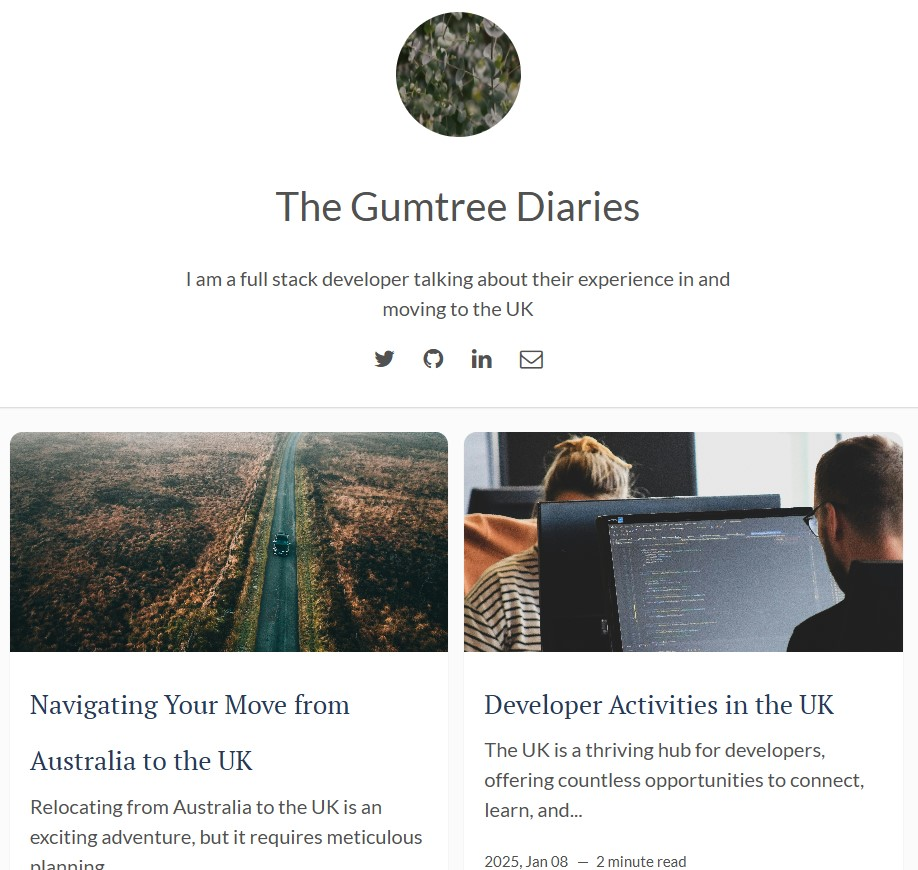

# README

## About This Project




Welcome to my travel blog! This site serves as a personal diary documenting my journey of moving to the UK and living there. From the excitement of relocating to the challenges of adapting to a new culture, I share my experiences, tips, and stories as they unfold. This blog is a space for self-reflection, storytelling, and connecting with others who might be on a similar journey.

## Features

- **Diary-Style Entries**: Regular posts about my experiences, thoughts, and adventures in the UK.  
- **Stylish Design**: Enhanced with [Google Fonts](https://fonts.google.com/) and [Font Awesome](http://fontawesome.io/) icons for a modern look.  
- **Interactive Comments**: Join discussions through the integrated [Disqus](https://disqus.com/) comment system. (Would like to add in future)
- **Emoji Support**: Add personality and emotion to posts with emoji support.  
- **Future Posts Enabled**: Display scheduled posts, even if they’re dated in the future, for better planning.  

## Purpose

This project is not just a blog—it's a personal space where I can document the highs, lows, and everything in between while transitioning to life in the UK. It’s for readers who love travel, enjoy personal stories, or are considering a similar move themselves.

## How to Run Locally

If you'd like to run this blog locally on your machine, follow these steps:

1. **Clone the Repository**  
   Clone the project repository to your local machine:
   ```bash
   git clone <repository-url>
   cd <repository-folder>
   ```

2. **Install Dependencies**  
   Ensure you have Ruby and Bundler installed, then run:
   ```bash
   bundle install
   ```

3. **Start the Local Server**  
   To serve the site locally and include future-dated posts, run:
   ```bash
   bundle exec jekyll serve --future
   ```

4. **View the Blog**  
   Open your browser and navigate to `http://localhost:4000` to view the blog locally.

## Future Plans

- Expand content with guides for others moving to the UK.  
- Post budgeting tips, travel insights, and advice on adapting to UK life.  
- Share reflections and lessons learned from living abroad.  

